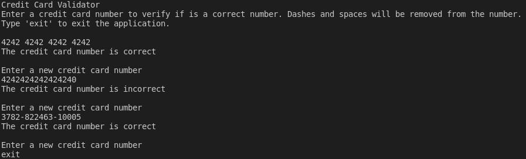

# Credit Card Validator

Implements the [Luhn algorithm](https://en.wikipedia.org/wiki/Luhn_algorithm), an algorithm used, for example, to verify if a credit card number has been entered correctly or not.

This project uses CMake as its build system. To compile the app, run `cmake -S . -B build` and then `cmake --build build`. Finally, run the app with `./build/app`.

The code has some tests to verify it's correctness. The tests use the [GoogleTest](https://google.github.io/googletest/) framework. Run them with `./build/app_test` after following the same steps as the build for main app.
