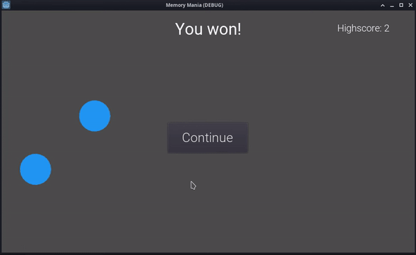

# Memory Mania

A game where pieces are highlighted in sequence and you try to follow the same sequence.

## TODO
- ~~Avoid overlapping pieces~~
- ~~Use an image for the pieces and for each of its state (default, hover, correct, wrong)~~
- ~~Show the restart button in front of the pieces~~
- Make the restart button text dynamic (start, retry, continue)
- Have an easy and hard mode
    - Easy: show the already correctly clicked pieces in green
    - Hard: make correctly clicked pieces go back to the default color
- Make the font look crisp
