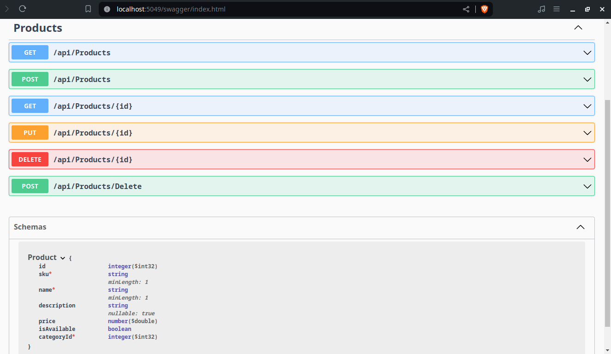

# H Plus Sport

This project is based on the [Building Web APIs with ASP.NET Core in .NET](https://www.linkedin.com/learning/building-web-apis-with-asp-dot-net-core-in-dot-net/using-entity-framework-core) course by Christian Wenz on LinkedIn Learning.



The project represents a backend service for a store. It exposes HTTP methods to list all products (`GET /api/Products`), add a product (`POST /api/Products`), show the details of a specific product (`GET /api/Products/{id}`), update a product (`PUT /api/Products/{id}`), remove a product (`DELETE /api/Products/{id}`), and remove a list of products (`POST /api/Products/Delete`).

It uses an in-memory database with an initial list of sample products.

## How to use

This project was built with .NET 8. You can get it from [https://dotnet.microsoft.com/en-us/download](https://dotnet.microsoft.com/en-us/download).

To start the API service, use `dotnet run` in the command line. If you want to make changes to the project and see them live with hot-reload enabled, use `dotnet watch`.

Running `dotnet run` will output several log lines. The one that starts with "Now listening on:" mentions the base URL, which will be something like `http://localhost:<RANDOM_PORT>`.

Open `http://localhost:<RANDOM_PORT>/swagger` in a browser to see the OpenAPI specification.

Open `http://localhost:<RANDOM_PORT>/api/Products` in a browser or an API testing tool like Postman to interact with the Products API directly.

## Project structure

The API handling is in the `ProductsController` class under the `Controllers` folder.

The `Models` folder holds the classes with the data models and initial data.

The `Program` class at the project's root folder holds the service configuration, in particular, the in-memory database configuration.

## Setup steps

The `aspnet-codegenerator` scaffolding tool was used to generate the initial `ProductsController` file, although in hindsight that could be avoided by creating the file manually.

It was installed globally with the command `dotnet tool install --global dotnet-aspnet-codegenerator`.

After that, the `ProductsController` file was generated with the following command:
```
dotnet aspnet-codegenerator --project . controller --controllerName ProductsController --useAsyncActions --relativeFolderPath Controllers --restWithNoViews -namespace HPlusSport.API.Controllers
```

Additionally, the `Microsoft.EntityFrameworkCore` and `Microsoft.EntityFrameworkCore.InMemory` packages where used in this project and added as follows:
```
dotnet add package Microsoft.EntityFrameworkCore
dotnet add package Microsoft.EntityFrameworkCore.InMemory
```
