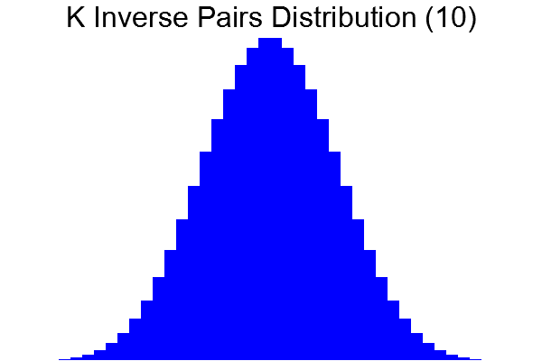

# K Inverse Pairs



Inspired by the [K Inverse Pairs Array](https://leetcode.com/problems/k-inverse-pairs-array/description/) problem on LeetCode.

LeetCode defines K Inverse Pairs as this:
> For an integer array `nums`, an inverse pair is a pair of integers `[i, j]` where `0 <= i < j < nums.length` and `nums[i] > nums[j]`.

For example, `[1,2,3]` has `0` pairs where an earlier item is greater than a later item.
In `[1,3,2]`, there is `1` inverse pair: `[3,2]`.
In `[3,2,1]`, there are `3` inverse pairs: `[3,2]`, `[3,1]`, and `[2,1]`.

I counted the inverse pairs of the arrays with 3 and 4 items and I noticed that the frequency of each pair looked like a normal (gaussian) distribution, so I decided to try plotting it as a histogram to see if that was true.

I'm trying to learn Rust but it's a bit daunting to use, so I built a proof of concept in Python first and used that as a starting point and also to compare results.

One thing I noticed when comparing Python and Rust versions is how noticeably slower Python was starting to become with an array of 9 or more elements. With 9 elements, Rust finished in under 1 second while Python needed 4 seconds to complete. With 10 elements, Rust took 2 seconds and Python 43 seconds.

## Build

To build the project, install Rust and then run `cargo build --release` from the `k-inverse-pairs` folder.

To build for Windows from Linux, I had to install `mingw-w64`, add Windows as a target with `rustup target add x86_64-pc-windows-gnu`, and then run `cargo build --release --target x86_64-pc-windows-gnu`.

The result of the build will be in the `target` folder.

## Run

To run the progam, use the build from the previous step or use the following command, which will also create a build if there wasn't one before.

```cargo run --release <number>```

Replace `<number>` with a number between 3 and 20 inclusive. Note that the processing time is exponential. Processing 14 elements took several days.

It will output the histogram as a dictionary to the console and also save an image of the histogram.

Run the Python version of the program with the following command.

```python3 src/main.py <number>```

It will only output the histogram as a dictionary to the console.
