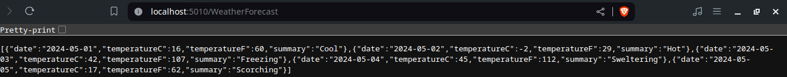
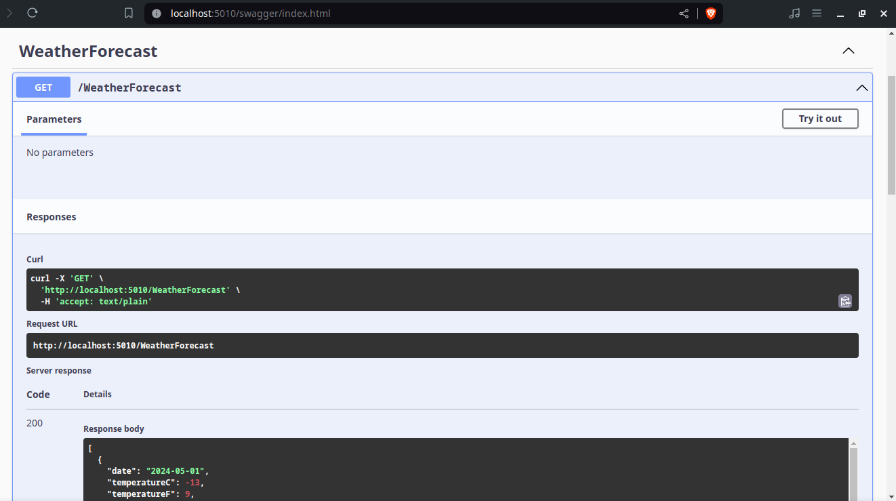

# Weather Forecast

This project provides an API which generates a random temperature and weather condition description for the next 5 days.
It's an example project created by the cli to serve as a starting point to start creating an API.

WeatherForecast API result


OpenAPI Specification page


## How to use the project

This project was built with .NET. Get it from [https://dotnet.microsoft.com/en-us/download](https://dotnet.microsoft.com/en-us/download).

This project was generated with the following command:
```
dotnet new webapi --use-controllers --no-https -n weather-forecast
```

To start the API service run `dotnet run` from the terminal and inside de `weather-forecast` folder.

This will output several log lines. The one that starts with "Now listening on:" mentions the base URL, which will be something like `http://localhost:<RANDOM_PORT>`.

Open `http://localhost:<RANDOM_PORT>/swagger` in a browser to see the OpenAPI Specification.

Open `http://localhost:<RANDOM_PORT>/WeatherForecast` in a browser to interact with the weather forecast API directly.
