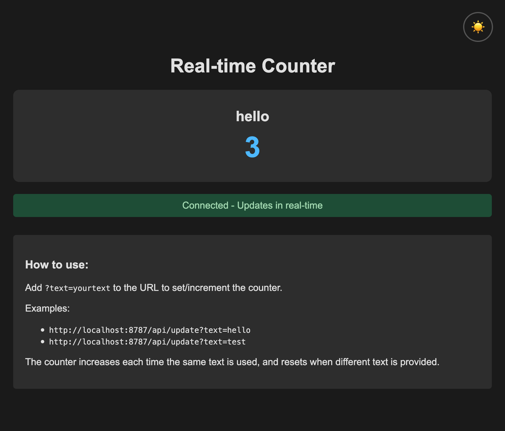

# Cloudflare WebSocket Counter

A real-time WebSocket counter app running on Cloudflare Workers, using Durable Objects for state management.



## Requirements

- [Node.js](https://nodejs.org/)
- [npm](https://www.npmjs.com/)
- [Cloudflare account](https://dash.cloudflare.com/)
- [Wrangler CLI](https://developers.cloudflare.com/workers/wrangler/) (`npm install -g wrangler or nxp wrangler`)

## Setup & Development

1. **Start the development server:**
    ```sh
    npm run dev
    # or
    npm start
    ```
    Open [http://localhost:8787/](http://localhost:8787/) in your browser.

2. **Generate Cloudflare types (after changing bindings in wrangler.jsonc):**
    ```sh
    npm run cf-typegen
    # or
    npm run types
    ```

3. **Deploy to Cloudflare:**
    ```sh
    npm run deploy
    ```

---

For more details, see [Cloudflare Workers documentation](https://developers.cloudflare.com/workers/).
- https://developers.cloudflare.com/durable-objects/examples/build-a-counter/
- https://developers.cloudflare.com/durable-objects/examples/websocket-server/
- https://developers.cloudflare.com/durable-objects/examples/websocket-hibernation-server/
- https://developers.cloudflare.com/workers/runtime-apis/bindings/rate-limit/