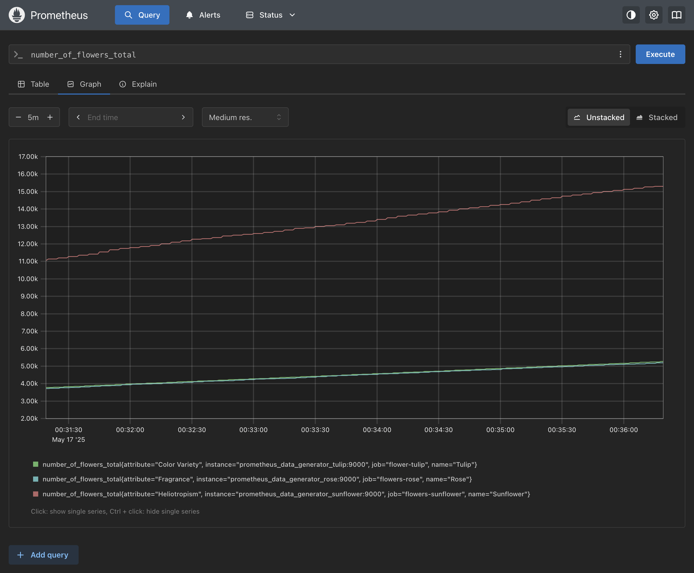

# Prometheus

Prometheus is an open-source monitoring system and time series database.
This project is a simple example of how to use it using the [getting started guide](https://prometheus.io/docs/prometheus/latest/getting_started/) as a starting point.

The following tools are used:
- [Prometheus](https://prometheus.io): Collect metrics
- [prometheus-data-generator](https://github.com/little-angry-clouds/prometheus-data-generator): Generate random metrics
- [Docker Compose](https://docs.docker.com/compose/): Run multiple containers

## Setup

The project consists of four services:
- `prometheus_data_generator_rose`: Generates random metrics for roses. See [config](prometheus-data-generator-rose.yml) for details.
- `prometheus_data_generator_sunflower`: Generates random metrics for sunflowers. See [config](prometheus-data-generator-sunflower.yml) for details.
- `prometheus_data_generator_tulip`: Generates random metrics for tulips. See [config](prometheus-data-generator-tulip.yml) for details.
- `prometheus`: The main service that collects metrics from the data generator services. See [config](prometheus.yml) for details.


## Start monitoring

To start all the service using docker compose, run the following command:

```bash
docker compose up --detach
```

See [docker-compose.yml](docker-compose.yml) for more details.

The prometheus-data-generator service is built from the [prometheus-data-generator/Dockerfile](prometheus-data-generator/Dockerfile) file and can become cached. To force a rebuild, run:

```bash
docker compose up --build --detach
```

## View raw service metrics

Visit these URLs to see the raw metrics from the data generator services
- http://localhost:9000/metrics
- http://localhost:9001/metrics
- http://localhost:9002/metrics

## View service metrics in Prometheus

Visit this URL to interact with Prometheus
- http://localhost:9090/query

## Queries

Run the following query to see the absolute values
```promql
number_of_flowers_total
```


You can also filter by label
```promql
number_of_flowers_total{name="Tulip"}
```

Switch to the Graph tab to see the visual representation of the metrics over time.



Run the following query to see how much the values change. 
```promql
rate(number_of_flowers_total[30s])
```


## Grafana

Visit this URL to interact with Grafana
- http://localhost:3000

The default credentials are:
- username: admin
- password: admin

### Configure Data Sources

Go to Connections -> Data Sources and add Prometheus as a data source.
Set the Prometheus server URL to `http://prometheus:9090/`. Scroll down and click `Save & test`.

### Configure Dashboards

Go to Dashboards and create new dashboard by adding a visualization and selecting prometheus as the data source.
Set the metric to `number_of_flowers_total`. Set the operation to Range functions -> Rate and Range to `$__rate_interval`.
Save the dashboard.


### Backup and Restore Grafana data

To backup the Grafana data, run the following command while the service is running:

```bash
docker cp prometheus-grafana-1:/var/lib/grafana/grafana.db grafana.db --archive
```

To restore the Grafana data, run the following command while the service is running:

```bash
docker cp grafana.db prometheus-grafana-1:/var/lib/grafana/grafana.db --archive
```

Restart the service to complete the restore process.

## Cleanup

To stop all the services and remove the data, run the following command:

```bash
docker compose down --volumes
```
