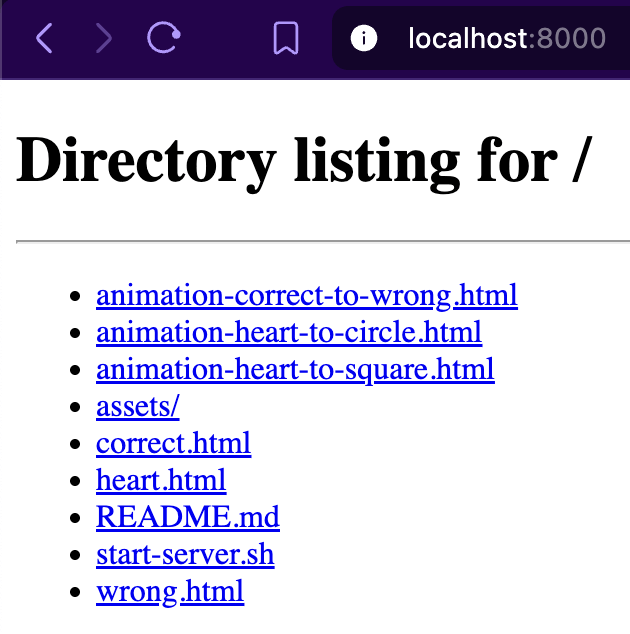

# CSS Shapes

A collection of CSS shapes to practice CSS.

## Start server

Run a server that exposes the local files in a browser. Requires [Python 3](https://www.python.org/downloads/).

```bash
./start-server.sh
```

Access the server at http://localhost:8000 and click on one of the html files.



## Shapes

### Heart


### Correct


### Wrong


## Animation Correct to Wrong


## Animation Heart to Circle


## Animation Heart to Square

