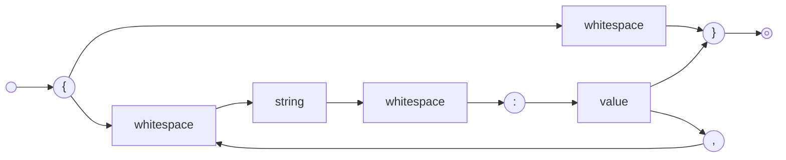
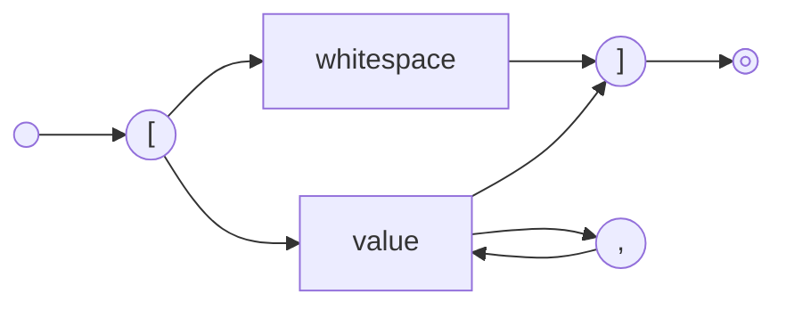
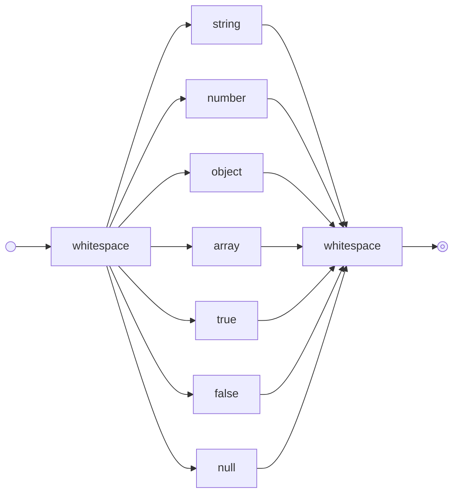
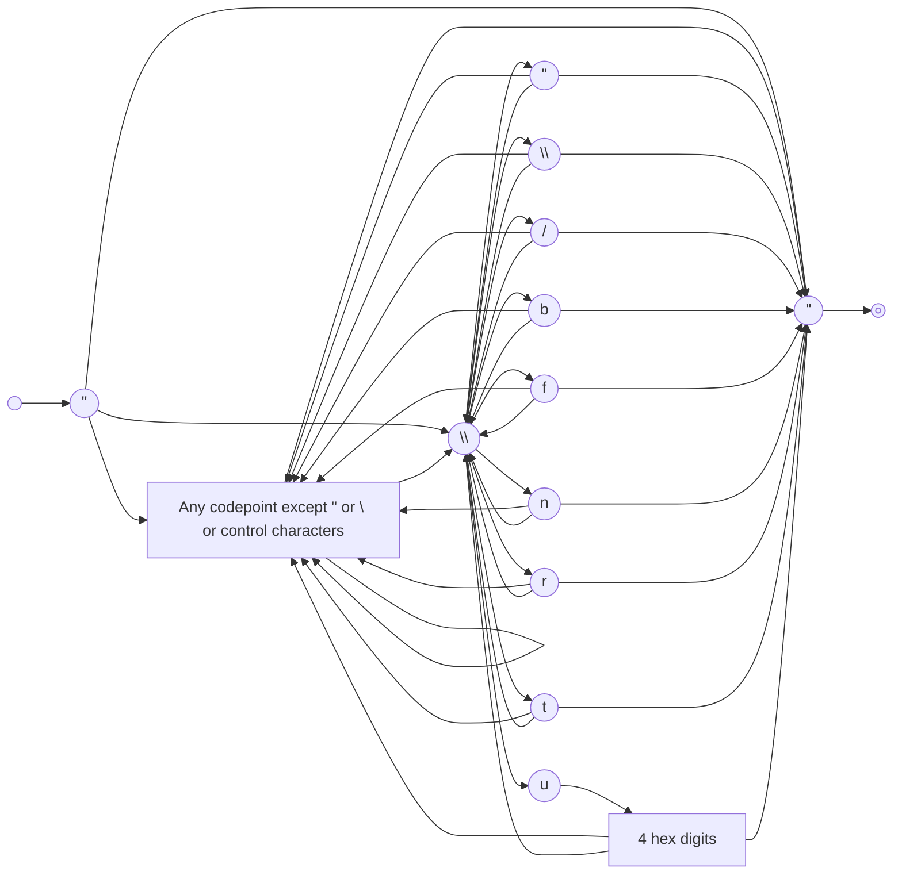
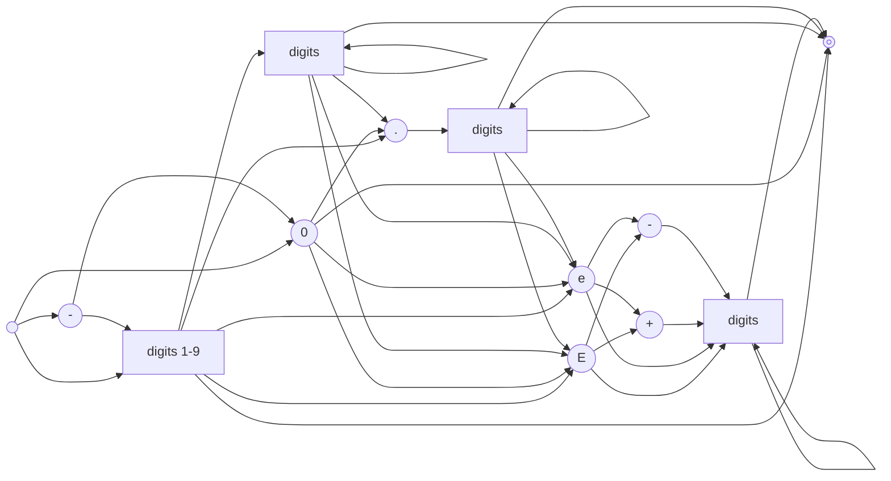
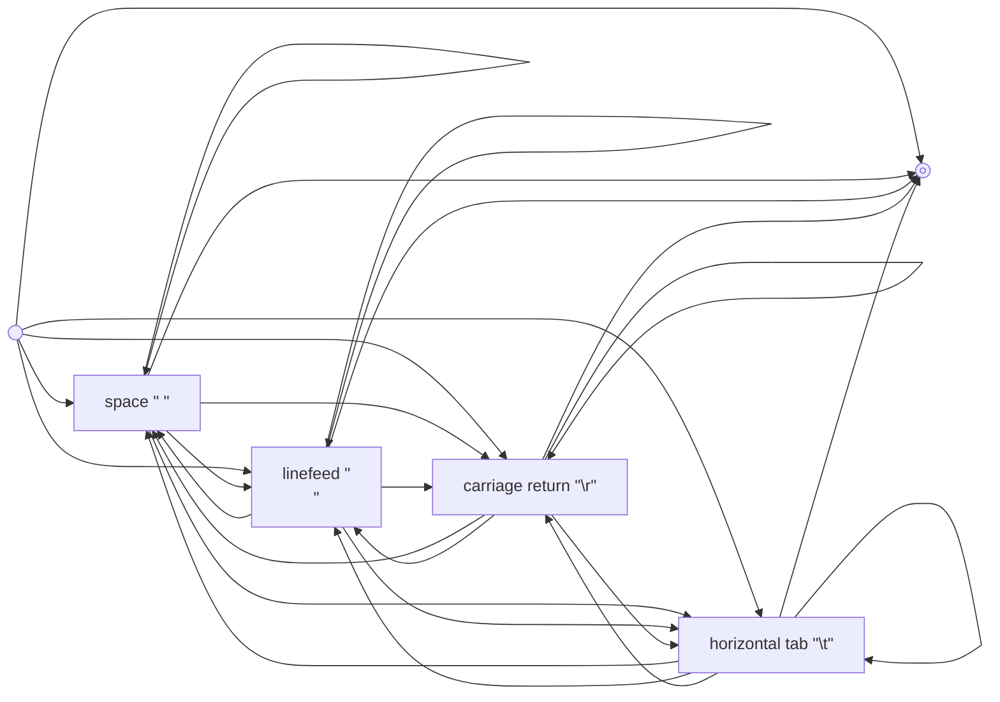

# JSON Diagrams

Mermaid diagrams of the JSON diagrams at https://www.json.org/json-en.html.

## object

```mermaid
flowchart LR
    start@{ shape: start }
    stop@{ shape: stop }
    open_brace(("&nbsp;{&nbsp;"))
    whitespace["whitespace"]
    whitespace_2["whitespace"]
    whitespace_3["whitespace"]
    close_brace(("&nbsp;}&nbsp;"))
    comma(("&nbsp;,&nbsp;"))
    colon(("&nbsp;:&nbsp;"))
    string
    value

    start --> open_brace
    open_brace --> whitespace
    open_brace --> whitespace_2
    whitespace --> close_brace
    close_brace --> stop
    whitespace_2 --> string
    string --> whitespace_3
    whitespace_3 --> colon
    colon --> value
    value --> comma
    value --> close_brace
    comma --> whitespace_2
```

## array

```mermaid
flowchart LR
    start@{ shape: start }
    stop@{ shape: stop }
    open_bracket(("&nbsp;[&nbsp;"))
    close_bracket(("&nbsp;]&nbsp;"))
    whitespace
    comma(("&nbsp;,&nbsp;"))
    value

    start --> open_bracket
    open_bracket --> whitespace
    open_bracket --> value
    whitespace --> close_bracket
    value --> close_bracket
    value --> comma
    comma --> value
    close_bracket --> stop
```

## value

```mermaid
flowchart LR
    start@{ shape: start }
    stop@{ shape: stop }
    whitespace
    whitespace_2[whitespace]
    string
    number
    object
    array
    true
    false
    null

    start --> whitespace
    whitespace --> string
    whitespace --> number
    whitespace --> object
    whitespace --> array
    whitespace --> true
    whitespace --> false
    whitespace --> null
    string --> whitespace_2
    number --> whitespace_2
    object --> whitespace_2
    array --> whitespace_2
    true --> whitespace_2
    false --> whitespace_2
    null --> whitespace_2
    whitespace_2 --> stop
```

## string

```mermaid
flowchart LR
    start@{ shape: start }
    stop@{ shape: stop }
    open_quote(("&nbsp;&quot;&nbsp;"))
    close_quote(("&nbsp;&quot;&nbsp;"))
    any_codepoint["Any codepoint except &quot; or \ or control characters"]
    backslash(("&nbsp;\\&nbsp;"))
    backslash_2(("&nbsp;\\&nbsp;"))
    quote(("&nbsp;&quot;&nbsp;"))
    slash(("&nbsp;/&nbsp;"))
    b(("&nbsp;b&nbsp;"))
    f(("&nbsp;f&nbsp;"))
    n(("&nbsp;n&nbsp;"))
    r(("&nbsp;r&nbsp;"))
    t(("&nbsp;t&nbsp;"))
    u(("&nbsp;u&nbsp;"))
    4_hex_digits["4 hex digits"]

    start --> open_quote
    open_quote --> any_codepoint
    open_quote --> backslash
    open_quote --> close_quote
    any_codepoint --> close_quote
    any_codepoint --> any_codepoint
    any_codepoint --> backslash
    backslash --> quote
    backslash --> backslash_2
    backslash --> slash
    backslash --> b
    backslash --> f
    backslash --> n
    backslash --> r
    backslash --> t
    backslash --> u
    quote --> close_quote
    quote --> any_codepoint
    quote --> backslash
    backslash_2 --> close_quote
    backslash_2 --> any_codepoint
    backslash_2 --> backslash
    slash --> close_quote
    slash --> any_codepoint
    slash --> backslash
    b --> close_quote
    b --> any_codepoint
    b --> backslash
    f --> close_quote
    f --> any_codepoint
    f --> backslash
    n --> close_quote
    n --> any_codepoint
    n --> backslash
    r --> close_quote
    r --> any_codepoint
    r --> backslash
    t --> close_quote
    t --> any_codepoint
    t --> backslash
    u --> 4_hex_digits
    4_hex_digits --> close_quote
    4_hex_digits --> any_codepoint
    4_hex_digits --> backslash
    close_quote --> stop
```

## number

```mermaid
--- 
config: 
  layout: elk1
---
flowchart LR
    start@{ shape: start }
    stop@{ shape: stop }
    minus(("&nbsp;-&nbsp;"))
    zero(("&nbsp;0&nbsp;"))
    digits_1_9["digits 1-9"]
    digits
    digits_2[digits]
    digits_3[digits]
    period(("&nbsp;.&nbsp;"))
    E(("&nbsp;E&nbsp;"))
    e(("&nbsp;e&nbsp;"))
    minus_2(("&nbsp;-&nbsp;"))
    plus(("&nbsp;+&nbsp;"))

    start --> minus
    start --> digits_1_9
    start --> zero
    minus --> digits_1_9
    minus --> zero
    digits_1_9 --> digits
    digits_1_9 --> period
    digits_1_9 --> E
    digits_1_9 --> e
    digits_1_9 --> stop
    zero --> period
    zero --> E
    zero --> e
    zero --> stop
    digits --> digits
    digits --> period
    digits --> E
    digits --> e
    digits --> stop
    period --> digits_2
    digits_2 --> digits_2
    digits_2 --> E
    digits_2 --> e
    digits_2 --> stop
    E --> plus
    E --> minus_2
    E --> digits_3
    e --> plus
    e --> minus_2
    e --> digits_3
    plus --> digits_3
    minus_2 --> digits_3
    digits_3 --> digits_3
    digits_3 --> stop
```

## whitespace

```mermaid
flowchart LR
    start@{ shape: start }
    stop@{ shape: stop }
    space["space &quot; &quot;"]
    linefeed["linefeed &quot;\n&quot;"]
    carriage_return["carriage return &quot;\r&quot;"]
    horizontal_tab["horizontal tab &quot;\t&quot;"]

    start --> space
    start --> linefeed
    start --> carriage_return
    start --> horizontal_tab
    start --> stop
    space --> space
    space --> linefeed
    space --> carriage_return
    space --> horizontal_tab
    space --> stop
    linefeed --> space
    linefeed --> linefeed
    linefeed --> carriage_return
    linefeed --> horizontal_tab
    linefeed --> stop
    carriage_return --> space
    carriage_return --> linefeed
    carriage_return --> carriage_return
    carriage_return --> horizontal_tab
    carriage_return --> stop
    horizontal_tab --> space
    horizontal_tab --> linefeed
    horizontal_tab --> carriage_return
    horizontal_tab --> horizontal_tab
    horizontal_tab --> stop
```
