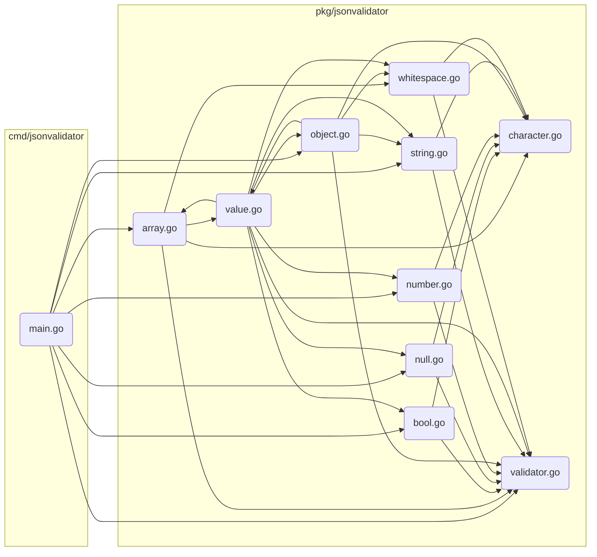

# JSON Validator

A JSON validator based on the official definition at https://www.json.org/json-en.html and written in Go.

It covers most of the standard, except for strings, where it only covers ASCII characters instead of Unicode characters to keep the scope manageable.

AI was used mainly to understand Go and debug the code, and minimally to generate code as this was more of a learning exercise.

## Motivation

The goal of this project was to build a simple command-line interface (CLI) in Go to learn how the language works.

## Lessons Learned

- When vertically aligning the fields passed in to a struct, the last item also needs a trailing comma.
    For example, assuming there is a struct State with fields Success and Message, writing it as
    ```go
    State{
        Success: true,
        Message: "Ok"
    }
    ```
    is invalid because it's missing a comma after `"Ok"` so it needs to be written as
    ```go
    State{
        Success: true,
        Message: "Ok",
    }
    ```

- Struct fields that start with a lowercase letter are considered private. This means that if code outside of the package needs to instantiate the struct and set the field, it needs to start with an uppercase letter.
    ```go
    Struct{
        privateField,
        PublicField,
    }
    ```

- Go comes bundled with a lot of convenient command-line utilities, and all of the ones I tried were very fast to run. The two that I used the most were `go fmt` to format the code and `go test` to run the test suite.

- Files that are part of the same package need to have unique content. For example, when defining a function, its name can only appear once across all files of the same package. This makes sense but is different compared to languages like Python and JavaScript, where imports are based on files and folders.

## Project Structure

### Folder structure

```
├── cmd
│   └── jsonvalidator
│       └── main.go # CLI entry point
├── pkg
│   └── jsonvalidator
│       ├── array.go
│       ├── bool.go
│       ├── character.go
│       ├── go.mod
│       ├── null.go
│       ├── number.go
│       ├── object.go
│       ├── string.go
│       ├── validator.go # Generic validator
│       ├── value.go
│       └── whitespace.go
└── test
    ├── array_test.go
    ├── bool_test.go
    ├── null_test.go
    ├── number_test.go
    ├── object_test.go
    ├── string_test.go
    ├── value_test.go
    └── whitespace_test.go
```

### File dependencies



## Setup

### Prerequisites

- [Go](https://go.dev/dl/)

### Run the main app directly

```bash
go run cmd/jsonvalidator/main.go '{"ab c": [123, true, null]}'
```
Output
```
{"ab c": [123, true, null]} is valid JSON
```

### Build and then run the CLI

```bash
go build -o json-validator-cli cmd/jsonvalidator/main.go
```

```bash
./json-validator-cli 1
./json-validator-cli '"a"'
./json-validator-cli "\"a\""
./json-validator-cli true
./json-validator-cli null
./json-validator-cli '{"abc": 123}'
./json-validator-cli '[1, "abc", true]'
```

### Run Tests

```bash
go test ./test
```

### Debugging

### Add Print Statements

Finds lines like `func ValueWhitespaceN2(state State) State {` and appends a line like `    fmt.Println("ValueWhitespaceN2", state.Index)`.

```bash
sed -i "" -E 's/^(func ([A-Za-z0-9]+)\(state State\) State \{)/\1\n\tfmt.Println("\2", state.Index)/' pkg/jsonvalidator/*.go
```

### Remove Print Statements

Removes lines like `    fmt.Println("ValueWhitespaceN2", state.Index)`

```bash
sed -i "" -E '/^\tfmt.Println\("[A-Za-z0-9]+", state.Index\)/d' pkg/jsonvalidator/*.go
```
