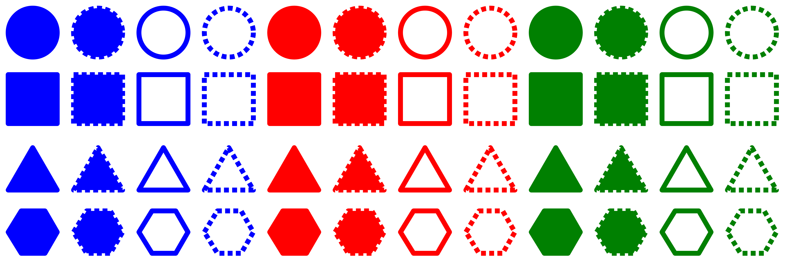

# SVG Shapes

This project is a proof of concept that generates SVG shapes with various attribute options.
It's a precursor to the [decision tree](../decision_tree) project.

Attribute options:
- **Shapes**: circle, square, triangle, hexagon
- **Colors**: red, green, blue
- **Filled**: yes, no
- **Dashed border**: yes, no

Shape size was discarded as an option, since whether a shape appears large or small is only obvious when compared to another shape.
In isolation, size is much less apparent.
