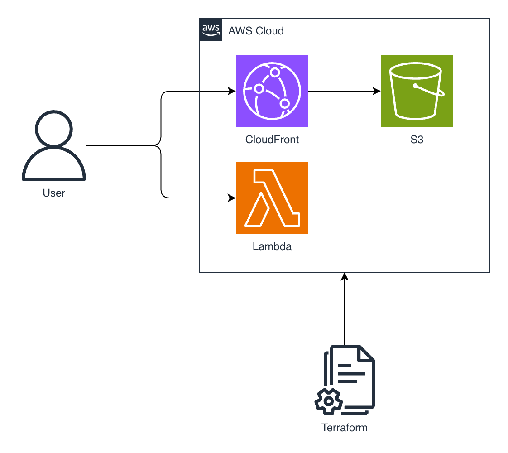

# Deploy to AWS with Terraform

This repository shows how to deploy a web application to AWS (Lambda, S3, CloudFront) using Terraform.



[Random Word Architecture diagram file](https://app.diagrams.net/?title=random-word-architecture#Uhttps%3A%2F%2Fraw.githubusercontent.com%2Fdanielwohlgemuth%2Fexperiments%2Frefs%2Fheads%2Fmain%2F2026%2Fterraform-aws%2Fassets%2Frandom_word.drawio)

The application is a web application that generates random words.


## Prerequisite

- OpenTofu
- AWS CLI
- AWS Account

## Setup

Set the access token

```bash
export AWS_ACCESS_KEY_ID="<aws_access_key_id>"
export AWS_SECRET_ACCESS_KEY="<aws_secret_access_key>"
```

```bash
tofu init
tofu plan
tofu apply
```

Other useful commands

```bash
tofu fmt
tofu validate
```


